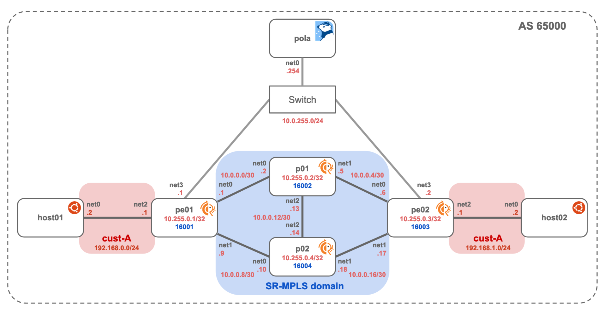

# SR-MPLS TE + VPNv4

Example topology powered by [Containerlab](https://containerlab.dev/)



## Requirements

* container host (Linux)
* FRRouting image (`frrouting/frr:v8.4.1`)
* MPLS kernel modules on the container host (`mpls_router`, `mpls_gso`, `mpls_iptunnel`)
* Pola helper image (`ghcr.io/nttcom/pola:latest-debug`)
* Host utility image (`wbitt/network-multitool:latest`)

See [Prerequisites](../README.md#prerequisites) for how to install Containerlab and
prepare these images.

## Usage

### Building a Lab Network

Start Containerlab network

```bash
git clone https://github.com/nttcom/pola
cd pola/examples/containerlab/sr-mpls-explicit-path-l3vpn

sudo containerlab deploy
```

### Apply SR Policy

Connect to PCEP container, check PCEP session and SR policy

```bash
$ docker exec -it clab-sr-mpls-explicit-path-l3vpn-pola bash

root@pola:/pola# pola session
sessionAddr(0): 10.0.255.1
  State: SESSION_STATE_UP
  Capabilities: [Stateful Update Instantiation Color SR-TE]
  IsSynced: true
sessionAddr(1): 10.0.255.2
  State: SESSION_STATE_UP
  Capabilities: [Stateful Update Instantiation Color SR-TE]
  IsSynced: true
root@pola:/pola# pola sr-policy list
No SR Policies found.
```

Both PE nodes establish a PCEP session, but this example only applies an SR Policy to pe01.

Apply and check SR Policy

`policy1.yaml` is mounted in the Pola container. It steers traffic from pe01 to
pe02 (10.255.0.3) along the explicit path p01 -> p02 -> pe02, using the
Prefix-SID labels 16002 (p01), 16004 (p02) and 16003 (pe02).

```bash
root@pola:/pola# pola sr-policy add -f policy1.yaml --no-sid-validate
success!
root@pola:/pola# pola sr-policy list
Session: 10.0.255.1
  PolicyName: policy1
    SrcAddr: 10.0.255.1
    DstAddr: 10.255.0.3
    Color: 0
    Preference: 0
    SegmentList: 16002 -> 16004 -> 16003
```

FRRouting does not report the color, the preference and the source address of an SR Policy back
to the PCE, so those fields of `policy1` differ from the applied policy. The applied color is
visible on pe01 itself with `show sr-te policy detail`.

Enter container pe01 and check SR Policy

```bash
root@pola:/pola# exit

$ docker exec -it clab-sr-mpls-explicit-path-l3vpn-pe01 vtysh
pe01# show sr-te pcep session

PCE POLA
 PCE IP 10.0.255.254 port 4189
 PCC IP 10.0.255.1 port 4189
 PCC MSD 4
 Session Status UP
 Precedence 255, best candidate
 Confidence normal
 Timer: KeepAlive config 30, pce-negotiated 30
 Timer: DeadTimer config 120, pce-negotiated 120
 Timer: PcRequest 30
 Timer: SessionTimeout Interval 30
 Timer: Delegation Timeout 10
 No TCP MD5 Auth
 PCE SR Version draft16 and RFC8408
 Next PcReq ID 1
 Next PLSP  ID 2
 Connected for 144 seconds, since 2026-07-30 09:51:31 UTC
 PCC Capabilities: [PCC and PCE Initiated LSPs] [Stateful PCE] [SR TE PST]
 PCE Capabilities: [Stateful PCE] [SR TE PST]
 PCEP Message Statistics
                        Sent   Rcvd
         Message Open:     1      1
    Message KeepAlive:     5      5
        Message PcReq:     0      0
        Message PcRep:     0      0
       Message Notify:     0      0
        Message Error:     0      0
        Message Close:     0      0
       Message Report:     4      0
       Message Update:     0      0
     Message Initiate:     0      1
     Message StartTls:     0      0
    Message Erroneous:     0      0
                Total:    10      7
PCEP Sessions => Configured 1 ; Connected 1

pe01# show sr-te policy detail

Endpoint: 10.255.0.3  Color: 1  Name: policy1  BSID: -  Status: Active
  * Preference: 255  Name: policy1  Type: dynamic  Segment-List: (created by PCE)  Protocol-Origin: PCEP
```

Add Color setting

```bash
$ docker exec -it clab-sr-mpls-explicit-path-l3vpn-pe01 bash
bash-5.1# vtysh -c 'conf t' -c 'router bgp 65000' -c 'address-family ipv4 vpn' -c 'neighbor 10.255.0.3 route-map color1 in'

bash-5.1# exit
```

The VPN route is now resolved through the SR Policy. Its label stack is the segment list of
`policy1`, without the first SID because p01 is directly connected:

```bash
$ docker exec -it clab-sr-mpls-explicit-path-l3vpn-pe01 vtysh
pe01# show ip route vrf cust-a 192.168.1.0/24
Routing entry for 192.168.1.0/24
  Known via "bgp", distance 20, metric 0, vrf cust-a, best
  Last update 00:00:20 ago
    10.255.0.3(vrf default) (recursive), label 17, weight 1
  *   10.0.0.2, via eth1(vrf default), label 16004/16003/17, weight 1
```

Check SR header with tcpdump

Send traffic from host01:

```bash
$ docker exec -it clab-sr-mpls-explicit-path-l3vpn-host01 bash
host01:/# ping -c 3 192.168.1.2
PING 192.168.1.2 (192.168.1.2) 56(84) bytes of data.
64 bytes from 192.168.1.2: icmp_seq=1 ttl=62 time=0.121 ms
64 bytes from 192.168.1.2: icmp_seq=2 ttl=62 time=0.110 ms
64 bytes from 192.168.1.2: icmp_seq=3 ttl=62 time=0.090 ms

--- 192.168.1.2 ping statistics ---
3 packets transmitted, 3 received, 0% packet loss, time 2049ms
rtt min/avg/max/mdev = 0.090/0.107/0.121/0.012 ms
```

Capture on the containerlab host. The FRR container has no tcpdump, so run the host's
tcpdump inside the container's network namespace with `nsenter`:

```bash
$ sudo nsenter -t $(docker inspect -f '{{.State.Pid}}' clab-sr-mpls-explicit-path-l3vpn-p01) -n tcpdump -nni eth1
tcpdump: verbose output suppressed, use -v[v]... for full protocol decode
listening on eth1, link-type EN10MB (Ethernet), snapshot length 262144 bytes
18:55:44.909823 MPLS (label 17, exp 0, [S], ttl 63) IP 192.168.1.2 > 192.168.0.2: ICMP echo reply, id 2218, seq 1, length 64
18:55:45.915956 MPLS (label 16004, exp 0, ttl 63) (label 16003, exp 0, ttl 63) (label 17, exp 0, [S], ttl 63) IP 192.168.0.2 > 192.168.1.2: ICMP echo request, id 2218, seq 2, length 64
18:55:45.916001 MPLS (label 17, exp 0, [S], ttl 63) IP 192.168.1.2 > 192.168.0.2: ICMP echo reply, id 2218, seq 2, length 64
18:55:46.939959 MPLS (label 16004, exp 0, ttl 63) (label 16003, exp 0, ttl 63) (label 17, exp 0, [S], ttl 63) IP 192.168.0.2 > 192.168.1.2: ICMP echo request, id 2218, seq 3, length 64
18:55:46.940001 MPLS (label 17, exp 0, [S], ttl 63) IP 192.168.1.2 > 192.168.0.2: ICMP echo reply, id 2218, seq 3, length 64
```

Also, you can analyze with Wireshark on your Local PC
([ref: Packet capture & Wireshark](https://containerlab.dev/manual/wireshark/)).

```bash
ssh $clab_host 'sudo nsenter -t $(docker inspect -f "{{.State.Pid}}" clab-sr-mpls-explicit-path-l3vpn-p01) -n tcpdump -U -nni eth1 -w -' | wireshark -k -i -
```

### Cleanup

```bash
sudo containerlab destroy
```
