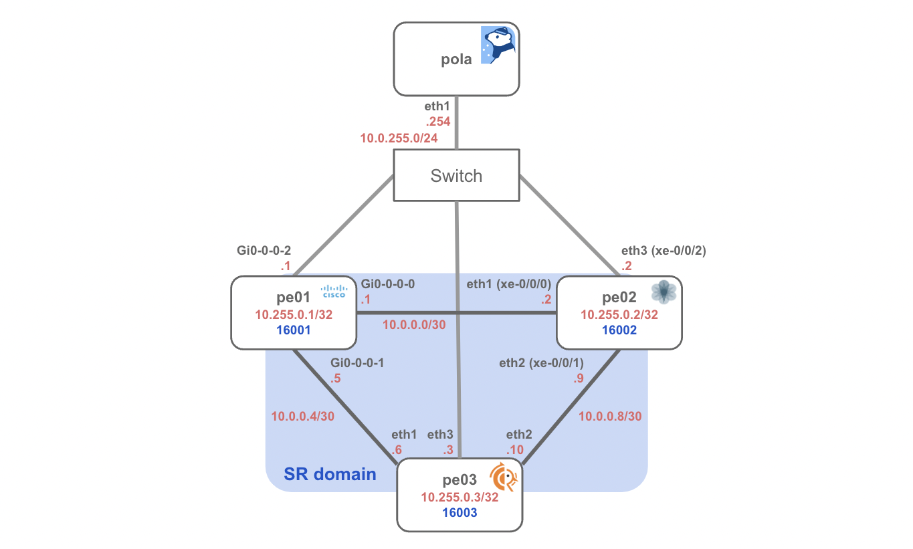

# SR-MPLS + PCEP (IOS-XR/Junos/FRRouting)

Example topology powered by [Containerlab](https://containerlab.dev/)


## Requirements

* container host (Linux)
* Cisco XRd image
* Juniper vMX image

## Usage

### Install Containerlab & XRd/vMX

**[Install Containerlab](https://containerlab.dev/install/)**

```bash
sudo bash -c "$(curl -sL https://get.containerlab.dev)"
```

**Install Cisco XRd**
Configure sysctl on host

```bash
$ vi /etc/sysctl.conf
fs.inotify.max_user_instances=64000
fs.inotify.max_user_watches=64000
net.core.netdev_max_backlog=300000
net.core.optmem_max=67108864
net.core.rmem_default=67108864
net.core.rmem_max=67108864
net.core.wmem_default=67108864
net.core.wmem_max=67108864
net.ipv4.udp_mem=1124736 10000000 67108864
$ sysctl -p
```

host-check (see: [Setting up the Host Environment to run XRd](https://xrdocs.io/virtual-routing/tutorials/2022-08-22-setting-up-host-environment-to-run-xrd/))

```bash
git clone https://github.com/ios-xr/xrd-tools
cd xrd-tools/scripts
./host-check --platform xrd-control-plane
```

Load XRd container image

```bash
docker load -i <xrd>.tar.gz
```

Install Juniper vMX on Vrnetlab

```bash
$ sudo apt install make
$ git clone https://github.com/hellt/vrnetlab && cd vrnetlab/vmx
$ cp ~/vmx-bundle-22.4R1.10.tgz .
$ sudo make
^Cmake[1]: *** [../makefile-install.include:39: docker-build] Interrupt
make: *** [../makefile.include:9: docker-image] Interrupt
$ sudo docker images                                       
REPOSITORY            TAG         IMAGE ID       CREATED         SIZE
vrnetlab/vr-vmx       22.4R1.10   6d2704750cd7   3 minutes ago   10.8GB
$ sudo rm -rf vrnetlab
$ sudo docker builder prune -a
```

### Building a Lab Network

Create bridge

```bash
sudo ip link add switch type bridge
sudo ip link set dev switch up
```

Enable MPLS kernel module

```bash
sudo modprobe mpls_router
sudo modprobe mpls_gso
sudo modprobe mpls_iptunnel
```

Start Containerlab network

```bash
git clone https://github.com/nttcom/pola
cd pola/examples/containerlab/sr-mpls_pcep
sudo containerlab deploy
```

Wait for starting vMX after execute `sudo containerlab deploy` (it takes some time).

```bash
$ docker logs clab-sr-mpls_pcep-pe02 -f
<snip.>
2023-02-20 15:03:26,233: launch     INFO     Startup complete in: 0:09:06.969773
```

### Check PCEP Session

Connect to PCEP container, check PCEP session and SR policy

```bash
$ sudo docker exec -it clab-sr-mpls_pcep-pola-pce bash
# polad -f polad.yaml  > /dev/null 2>&1 & 
# pola session
sessionAddr(0): 10.0.255.1
sessionAddr(1): 10.0.255.3
sessionAddr(2): 10.0.255.2
# pola sr-policy list
no SR Policies
```

Now the environment for PCEP verification is ready!
