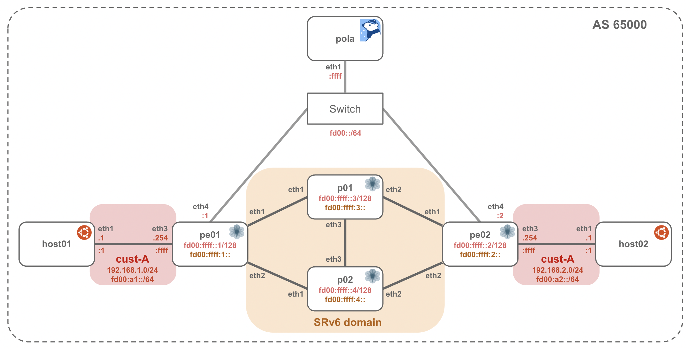

# SRv6 TE + VPNv4/VPNv6

Example topology powered by [Containerlab](https://containerlab.dev/)



## Requirements

* container host (Linux)
* Juniper vJunos-router image (`vrnetlab/juniper_vjunos-router:25.2R1.9`)
* Pola helper image (`ghcr.io/nttcom/pola:latest-debug`)
* Host utility image (`wbitt/network-multitool:latest`)

See [Prerequisites](../README.md#prerequisites) for how to install Containerlab and
prepare these images.

## Usage

### Building a Lab Network

Start Containerlab network

```bash
cd pola/examples/containerlab/srv6-explicit-path-l3vpn
sudo containerlab deploy
```

Wait for vJunos-router startup after `sudo containerlab deploy` (it takes several minutes).

```bash
$ docker logs clab-srv6-explicit-path-l3vpn-p01 -f
<snip.>
2026-08-27 02:50:06,324: launch     INFO Startup complete in: 0:08:27.376646
```

### Apply SR Policy

Connect to PCEP container, check PCEP session and SR policy

```bash
$ docker exec -it clab-srv6-explicit-path-l3vpn-pola bash

root@pola:/pola# pola session
Session #0: fd00::1
  State:             up
  LSP-DB Sync:       finished
  Role:              active-stateful-pce
  Up Time:           00:01:31
  Session ID:        Local=0, Peer=2
  Transport:         tcp, auth=none
  Timers:
               Local  Peer  Effective
    Keepalive  30     30    30
    DeadTimer  120    120   120
  Capabilities:
    Common:
      STATEFUL-PCE-CAPABILITY [RFC8231/8281]: Stateful, Update, Instantiation
      SR-PCE-CAPABILITY [RFC8664]: SR
      SRv6-PCE-CAPABILITY [RFC9603]: SRv6
      PATH-SETUP-TYPE-CAPABILITY [RFC8408]: SR-TE, SRv6-TE
      ASSOC-TYPE-LIST [RFC8697]:
        6 SR Policy Association
      MULTIPATH-CAP [draft-ietf-pce-multipath]: Multipath
    Local only:
      STATEFUL-PCE-CAPABILITY [RFC8231/8281]: Color
      SR-PCE-CAPABILITY [RFC8664]: Unlimited-SID-Depth
      MULTIPATH-CAP [draft-ietf-pce-multipath]: MaxMultipaths=1
    Peer only:
      VENDOR-INFORMATION [RFC7470]: 2636 (Juniper Networks, Inc.)
      SR-PCE-CAPABILITY [RFC8664]: MSD=5
      ASSOC-TYPE-LIST [RFC8697]:
        1 Path Protection Association
      MULTIPATH-CAP [draft-ietf-pce-multipath]: MaxMultipaths=128, Weighted

Session #1: fd00::2
  State:             up
  LSP-DB Sync:       finished
  Role:              active-stateful-pce
  Up Time:           00:01:56
  Session ID:        Local=0, Peer=1
  Transport:         tcp, auth=none
  Timers:
               Local  Peer  Effective
    Keepalive  30     30    30
    DeadTimer  120    120   120
  Capabilities:
    Common:
      STATEFUL-PCE-CAPABILITY [RFC8231/8281]: Stateful, Update, Instantiation
      SR-PCE-CAPABILITY [RFC8664]: SR
      SRv6-PCE-CAPABILITY [RFC9603]: SRv6
      PATH-SETUP-TYPE-CAPABILITY [RFC8408]: SR-TE, SRv6-TE
      ASSOC-TYPE-LIST [RFC8697]:
        6 SR Policy Association
      MULTIPATH-CAP [draft-ietf-pce-multipath]: Multipath
    Local only:
      STATEFUL-PCE-CAPABILITY [RFC8231/8281]: Color
      SR-PCE-CAPABILITY [RFC8664]: Unlimited-SID-Depth
      MULTIPATH-CAP [draft-ietf-pce-multipath]: MaxMultipaths=1
    Peer only:
      VENDOR-INFORMATION [RFC7470]: 2636 (Juniper Networks, Inc.)
      SR-PCE-CAPABILITY [RFC8664]: MSD=5
      ASSOC-TYPE-LIST [RFC8697]:
        1 Path Protection Association
      MULTIPATH-CAP [draft-ietf-pce-multipath]: MaxMultipaths=128, Weighted
root@pola:/pola# pola sr-policy list
Session: fd00::1 (State: up, LSP-DB Sync: finished)
  No SR Policies.

Session: fd00::2 (State: up, LSP-DB Sync: finished)
  No SR Policies.
```

### Applying SR Policies

The Pola container includes one explicit-path policy for each PCC.

| File | PCC | Endpoint | Segment List |
| --- | --- | --- | --- |
| `pe01-policy1.yaml` | pe01 | `fd00:ffff:2:0:1::` | p01 -> p02 -> pe02 |
| `pe02-policy1.yaml` | pe02 | `fd00:ffff:1:0:1::` | p02 -> p01 -> pe01 |

End SIDs are `fd00:ffff:1:0:1::` (pe01), `fd00:ffff:2:0:1::` (pe02), `fd00:ffff:3:0:1::` (p01)
and `fd00:ffff:4:0:1::` (p02).

```bash
root@pola:/pola# pola sr-policy add -f pe01-policy1.yaml --no-sid-validate
warning: skipping SID validation (--no-sid-validate)
success!
root@pola:/pola# pola sr-policy add -f pe02-policy1.yaml --no-sid-validate
warning: skipping SID validation (--no-sid-validate)
success!
root@pola:/pola# pola sr-policy list
Session: fd00::1 (State: up, LSP-DB Sync: finished)
  PolicyName: pe01-policy1
    PlspID: 1
    LSPID: 0
    State: active
    Type: explicit
    SrcAddr: fd00:ffff::1
    DstAddr: fd00:ffff:2:0:1::
    Color: 1
    Preference: 100
    SegmentList: fd00:ffff:3:0:1:: (local=fd00:ffff::3) -> fd00:ffff:4:0:1:: (local=fd00:ffff::4) -> fd00:ffff:2:0:1:: (local=fd00:ffff::2)

Session: fd00::2 (State: up, LSP-DB Sync: finished)
  PolicyName: pe02-policy1
    PlspID: 1
    LSPID: 0
    State: active
    Type: explicit
    SrcAddr: fd00:ffff::2
    DstAddr: fd00:ffff:1:0:1::
    Color: 1
    Preference: 100
    SegmentList: fd00:ffff:4:0:1:: (local=fd00:ffff::4) -> fd00:ffff:3:0:1:: (local=fd00:ffff::3) -> fd00:ffff:1:0:1:: (local=fd00:ffff::1)
```

Enter container pe01 and check SR Policy

* user: admin
* pass: admin@123

```bash
root@pola:/pola# exit

$ ssh clab-srv6-explicit-path-l3vpn-pe01 -l admin

admin@pe01> show path-computation-client lsp

  Name                                Status            PLSP-Id  LSP-Type       Controller       Path-Setup-Type       Template
  pe01-policy1                        (Act)             1        ext-provised   POLA             srv6-te

admin@pe01> show spring-traffic-engineering lsp detail
E = Entropy-label Capability

Name: pe01-policy1
  Tunnel-source: Path computation element protocol(PCEP)
  Tunnel Forward Type: SRV6
  To: fd00:ffff:2:0:1::-1<c6>
  From: fd00:ffff::1
  State: Up
    Path Status: NA
    Outgoing interface: NA
    Delegation compute constraints info:
      Actual-Bandwidth from PCUpdate: 0
      Bandwidth-Requested from PCUpdate: 0
      Setup-Priority: 0
      Reservation-Priority: 0
    Auto-translate status: Disabled Auto-translate result: N/A
    BFD status: N/A BFD name: N/A
    BFD remote-discriminator: N/A
    Segment ID : 128
    ERO Valid: true
      SR-ERO hop count: 3
        Hop 1 (Strict):
          NAI: IPv6 Node ID, Node address: fd00:ffff::3
          SID type: srv6-sid, Value: fd00:ffff:3:0:1::
        Hop 2 (Strict):
          NAI: IPv6 Node ID, Node address: fd00:ffff::4
          SID type: srv6-sid, Value: fd00:ffff:4:0:1::
        Hop 3 (Strict):
          NAI: IPv6 Node ID, Node address: fd00:ffff::2
          SID type: srv6-sid, Value: fd00:ffff:2:0:1::


Total displayed LSPs: 1 (Up: 1, Down: 0, Initializing: 0)

admin@pe01> show route table CUST-A.inet.0 192.168.2.0/24

CUST-A.inet.0: 3 destinations, 3 routes (3 active, 0 holddown, 0 hidden)
+ = Active Route, - = Last Active, * = Both

192.168.2.0/24     *[BGP/170] 00:01:15, localpref 100, from fd00:ffff::2
                      AS path: I, validation-state: unverified
                    >  to fe80::e00:91ff:fe5a:7301 via ge-0/0/0.0, SRv6 SID: fd00:ffff:2:0:4:a::, SRV6-Tunnel, Dest: fd00:ffff:2:0:1::-1<c6>

admin@pe01> show route table CUST-A.inet6.0 fd00:a2::/64

CUST-A.inet6.0: 5 destinations, 5 routes (5 active, 0 holddown, 0 hidden)
+ = Active Route, - = Last Active, * = Both

fd00:a2::/64       *[BGP/170] 00:01:30, localpref 100, from fd00:ffff::2
                      AS path: I, validation-state: unverified
                    >  to fe80::e00:91ff:fe5a:7301 via ge-0/0/0.0, SRv6 SID: fd00:ffff:2:0:6:a::, SRV6-Tunnel, Dest: fd00:ffff:2:0:1::-1<c6>
```

Enter container host01 and check SRv6-TE

* ping over VPN

```bash
admin@pe01> exit

$ docker exec -it clab-srv6-explicit-path-l3vpn-host01 /bin/bash

host01:/# ping -c 3 192.168.2.1
PING 192.168.2.1 (192.168.2.1) 56(84) bytes of data.
64 bytes from 192.168.2.1: icmp_seq=1 ttl=62 time=40.2 ms
64 bytes from 192.168.2.1: icmp_seq=2 ttl=62 time=6.79 ms
64 bytes from 192.168.2.1: icmp_seq=3 ttl=62 time=7.09 ms

host01:/# ping -c 3 fd00:a2::1
PING fd00:a2::1(fd00:a2::1) 56 data bytes
64 bytes from fd00:a2::1: icmp_seq=1 ttl=62 time=180 ms
64 bytes from fd00:a2::1: icmp_seq=2 ttl=62 time=6.97 ms
64 bytes from fd00:a2::1: icmp_seq=3 ttl=62 time=7.46 ms

```

* Capture on containerlab host

The FRR container has no tcpdump, so run the host's tcpdump inside the container's
network namespace with `nsenter`:

```bash
$ sudo nsenter -t $(docker inspect -f '{{.State.Pid}}' clab-srv6-explicit-path-l3vpn-pe01) -n tcpdump -nni eth1
libibverbs: Warning: couldn't open config directory '/etc/libibverbs.d'.
tcpdump: verbose output suppressed, use -v[v]... for full protocol decode
listening on eth1, link-type EN10MB (Ethernet), snapshot length 262144 bytes
02:56:55.290437 IP6 fd00:ffff::1 > fd00:ffff:3:0:1::: RT6 (len=6, type=4, segleft=2, last-entry=2, tag=0, [0]fd00:ffff:2:0:4:a::, [1]fd00:ffff:4:0:1::, [2]fd00:ffff:3:0:1::) IP 192.168.1.1 > 192.168.2.1: ICMP echo request, id 10694, seq 1, length 64
02:56:55.323726 IP6 fd00:ffff::2 > fd00:ffff:1:0:4:a::: RT6 (len=6, type=4, segleft=0, last-entry=2, tag=0, [0]fd00:ffff:1:0:4:a::, [1]fd00:ffff:3:0:1::, [2]fd00:ffff:4:0:1::) IP 192.168.2.1 > 192.168.1.1: ICMP echo reply, id 10694, seq 1, length 64
02:56:56.287226 IP6 fd00:ffff::1 > fd00:ffff:3:0:1::: RT6 (len=6, type=4, segleft=2, last-entry=2, tag=0, [0]fd00:ffff:2:0:4:a::, [1]fd00:ffff:4:0:1::, [2]fd00:ffff:3:0:1::) IP 192.168.1.1 > 192.168.2.1: ICMP echo request, id 10694, seq 2, length 64
02:56:56.292142 IP6 fd00:ffff::2 > fd00:ffff:1:0:4:a::: RT6 (len=6, type=4, segleft=0, last-entry=2, tag=0, [0]fd00:ffff:1:0:4:a::, [1]fd00:ffff:3:0:1::, [2]fd00:ffff:4:0:1::) IP 192.168.2.1 > 192.168.1.1: ICMP echo reply, id 10694, seq 2, length 64
02:56:57.288186 IP6 fd00:ffff::1 > fd00:ffff:3:0:1::: RT6 (len=6, type=4, segleft=2, last-entry=2, tag=0, [0]fd00:ffff:2:0:4:a::, [1]fd00:ffff:4:0:1::, [2]fd00:ffff:3:0:1::) IP 192.168.1.1 > 192.168.2.1: ICMP echo request, id 10694, seq 3, length 64
02:56:57.292767 IP6 fd00:ffff::2 > fd00:ffff:1:0:4:a::: RT6 (len=6, type=4, segleft=0, last-entry=2, tag=0, [0]fd00:ffff:1:0:4:a::, [1]fd00:ffff:3:0:1::, [2]fd00:ffff:4:0:1::) IP 192.168.2.1 > 192.168.1.1: ICMP echo reply, id 10694, seq 3, length 64
02:56:57.973543 IP6 fd00:ffff::1 > fd00:ffff:3:0:1::: RT6 (len=6, type=4, segleft=2, last-entry=2, tag=0, [0]fd00:ffff:2:0:6:a::, [1]fd00:ffff:4:0:1::, [2]fd00:ffff:3:0:1::) IP6 fd00:a1::1 > fd00:a2::1: ICMP6, echo request, id 10695, seq 1, length 64
02:56:58.145589 IP6 fd00:ffff::2 > fd00:ffff:1:0:6:a::: RT6 (len=6, type=4, segleft=0, last-entry=2, tag=0, [0]fd00:ffff:1:0:6:a::, [1]fd00:ffff:3:0:1::, [2]fd00:ffff:4:0:1::) IP6 fd00:a2::1 > fd00:a1::1: ICMP6, echo reply, id 10695, seq 1, length 64
02:56:58.968607 IP6 fd00:ffff::1 > fd00:ffff:3:0:1::: RT6 (len=6, type=4, segleft=2, last-entry=2, tag=0, [0]fd00:ffff:2:0:6:a::, [1]fd00:ffff:4:0:1::, [2]fd00:ffff:3:0:1::) IP6 fd00:a1::1 > fd00:a2::1: ICMP6, echo request, id 10695, seq 2, length 64
02:56:58.973750 IP6 fd00:ffff::2 > fd00:ffff:1:0:6:a::: RT6 (len=6, type=4, segleft=0, last-entry=2, tag=0, [0]fd00:ffff:1:0:6:a::, [1]fd00:ffff:3:0:1::, [2]fd00:ffff:4:0:1::) IP6 fd00:a2::1 > fd00:a1::1: ICMP6, echo reply, id 10695, seq 2, length 64
02:56:59.969785 IP6 fd00:ffff::1 > fd00:ffff:3:0:1::: RT6 (len=6, type=4, segleft=2, last-entry=2, tag=0, [0]fd00:ffff:2:0:6:a::, [1]fd00:ffff:4:0:1::, [2]fd00:ffff:3:0:1::) IP6 fd00:a1::1 > fd00:a2::1: ICMP6, echo request, id 10695, seq 3, length 64
02:56:59.975658 IP6 fd00:ffff::2 > fd00:ffff:1:0:6:a::: RT6 (len=6, type=4, segleft=0, last-entry=2, tag=0, [0]fd00:ffff:1:0:6:a::, [1]fd00:ffff:3:0:1::, [2]fd00:ffff:4:0:1::) IP6 fd00:a2::1 > fd00:a1::1: ICMP6, echo reply, id 10695, seq 3, length 64
```

Also, you can analyze with Wireshark on your Local PC
([ref: Packet capture & Wireshark](https://containerlab.dev/manual/wireshark/)).

```bash
ssh $clab_host 'sudo nsenter -t $(docker inspect -f "{{.State.Pid}}" clab-srv6-explicit-path-l3vpn-pe01) -n tcpdump -U -nni eth1 -w -' | wireshark -k -i -
```

### Cleanup

```bash
sudo containerlab destroy
```
