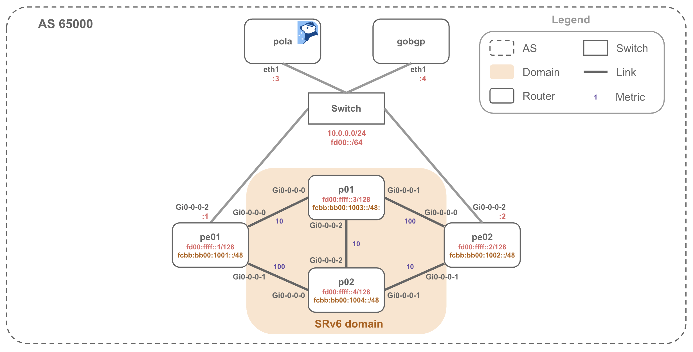

# SRv6 uSID Dynamic Path

Example topology powered by [Containerlab](https://containerlab.dev/)



## Requirements

* container host (Linux)
* Cisco XRd image (`ios-xr/xrd-control-plane:24.4.1`)
* Juniper vJunos-router image (`vrnetlab/juniper_vjunos-router:25.2R1.9`)
* Pola helper image (`ghcr.io/nttcom/pola:latest-debug`)
* Host utility image (`wbitt/network-multitool:latest`)
* Statically linked GoBGP binaries in `bin/` (`gobgpd`, `gobgp`, v4.0.0 or later)

See [Prerequisites](../README.md#prerequisites) for how to install Containerlab and
prepare these images.

## Usage

### Building a Lab Network

The `switch` bridge node is created automatically by Containerlab.

Copy the GoBGP binaries to `bin`:

```bash
make -C ../../.. fetch-gobgp
cp ../../../test/bin/gobgpd bin/gobgpd
cp ../../../test/bin/gobgp bin/gobgp
```

Pola and GoBGP start automatically when the lab is deployed.

Start Containerlab network

```bash
git clone https://github.com/nttcom/pola
cd pola/examples/containerlab/srv6-usid-dynamic-path

sudo containerlab deploy
```

Wait for vJunos-router startup after `sudo containerlab deploy` (it takes several minutes).

```bash
$ docker logs clab-srv6-usid-dynamic-path-pe02 -f
<snip.>
2026-07-30 10:32:50,476: launch      INFO Startup complete in: 0:01:41.309132
```

### Show TED

```bash
$ docker exec -it clab-srv6-usid-dynamic-path-pola bash

root@pola:/pola# pola ted -p 50052
Node: 1
  0000.0001.0001
  Hostname: pe01
  ISIS Area ID: 49.0000
  SRGB: 0 - 0
  Prefixes:
    fcbb:bb00:1001::/48
    fd00:ffff::1/128
  Links:
    Local: None Remote: None
      RemoteNode: 0000.0001.0003
      Metrics:
        METRIC_TYPE_IGP: 10
      Adj-SID: 0
      SRv6 End.X SID:
        EndpointBehavior: UA
        SIDs: [fcbb:bb00:1001:e000::]
        SID Structure: Block: 32, Node: 16, Func: 16, Arg: 64
    Local: None Remote: None
      RemoteNode: 0000.0001.0004
      Metrics:
        METRIC_TYPE_IGP: 100
      Adj-SID: 0
      SRv6 End.X SID:
        EndpointBehavior: UA
        SIDs: [fcbb:bb00:1001:e001::]
        SID Structure: Block: 32, Node: 16, Func: 16, Arg: 64
  SRv6 SIDs:
    SIDs: [fcbb:bb00:1001::]
    Block: 32, Node: 16, Func: 0, Arg: 80
    EndpointBehavior: UN, Flags: 0, Algorithm: 0
    MultiTopoIDs: [2]

Node: 2
<snip.>
```

### Apply SR Policy

Connect to PCEP container, check PCEP session and SR policy

```bash
root@pola:/pola# pola session -p 50052
sessionAddr(0): fd00::2
  State: SESSION_STATE_UP
  Capabilities: [Stateful Update Instantiation Color SR-TE SRv6-TE Multipath Vendor-Info(Juniper)]
  IsSynced: true

root@pola:/pola# pola sr-policy list -p 50052
No SR Policies found.
```

Apply and check SR Policy

`pe02-policy1.yaml` is mounted in the Pola container. It requests a dynamic path from pe02 to
pe01 (`fd00:ffff::1`) with color 100. End SIDs are `fcbb:bb00:1001::` (pe01),
`fcbb:bb00:1003::` (p01) and `fcbb:bb00:1004::` (p02), so the computed segment list below is the
path p02 -> p01 -> pe01.

```bash
root@pola:/pola# pola sr-policy add -f pe02-policy1.yaml -p 50052
success!
root@pola:/pola# pola sr-policy list -p 50052
Session: fd00::2
  PolicyName: DYNAMIC-POLICY
    SrcAddr: fd00:ffff::2
    DstAddr: fd00:ffff::1
    Color: 100
    Preference: 100
    SegmentList: fcbb:bb00:1004:: -> fcbb:bb00:1003:: -> fcbb:bb00:1001::
```

Enter container pe02 and check SR Policy

* user: admin
* pass: admin@123

```bash
root@pola:/pola# exit

$ ssh clab-srv6-usid-dynamic-path-pe02 -l admin

admin@pe02> show spring-traffic-engineering lsp brief
To                        State        LSPname
fd00:ffff::1-100<c6>      Up           DYNAMIC-POLICY


Total displayed LSPs: 1 (Up: 1, Down: 0, Initializing: 0)

admin@pe02> show spring-traffic-engineering lsp name DYNAMIC-POLICY detail
E = Entropy-label Capability

Name: DYNAMIC-POLICY
  Tunnel-source: Path computation element protocol(PCEP)
  Tunnel Forward Type: SRV6
  To: fd00:ffff::1-100<c6>
  From: fd00:ffff::2
  State: Up
    Path Status: NA
    Outgoing interface: NA
    Delegation compute constraints info:
      Actual-Bandwidth from PCUpdate: 0
      Bandwidth-Requested from PCUpdate: 0
      Setup-Priority: 0
      Reservation-Priority: 0
    Auto-translate status: Disabled Auto-translate result: N/A
    BFD status: N/A BFD name: N/A
    BFD remote-discriminator: N/A
    Segment ID : 128
    ERO Valid: true
      SR-ERO hop count: 3
        Hop 1 (Strict):
          NAI: IPv6 Node ID, Node address: fcbb:bb00:1004::
          SID type: Micro SRv6 SID, Value: fcbb:bb00:1004::
          SSTLV: BL: 32, NL: 16, FL: 0, AL: 80
          Endpoint Behavior: End with NEXT-CSID, PSP & USD
        Hop 2 (Strict):
          NAI: IPv6 Node ID, Node address: fcbb:bb00:1003::
          SID type: Micro SRv6 SID, Value: fcbb:bb00:1003::
          SSTLV: BL: 32, NL: 16, FL: 0, AL: 80
          Endpoint Behavior: End with NEXT-CSID, PSP & USD
        Hop 3 (Strict):
          NAI: IPv6 Node ID, Node address: fcbb:bb00:1001::
          SID type: Micro SRv6 SID, Value: fcbb:bb00:1001::
          SSTLV: BL: 32, NL: 16, FL: 0, AL: 80
          Endpoint Behavior: End with NEXT-CSID, PSP & USD


Total displayed LSPs: 1 (Up: 1, Down: 0, Initializing: 0)
```

### Cleanup

```bash
sudo containerlab destroy
```
