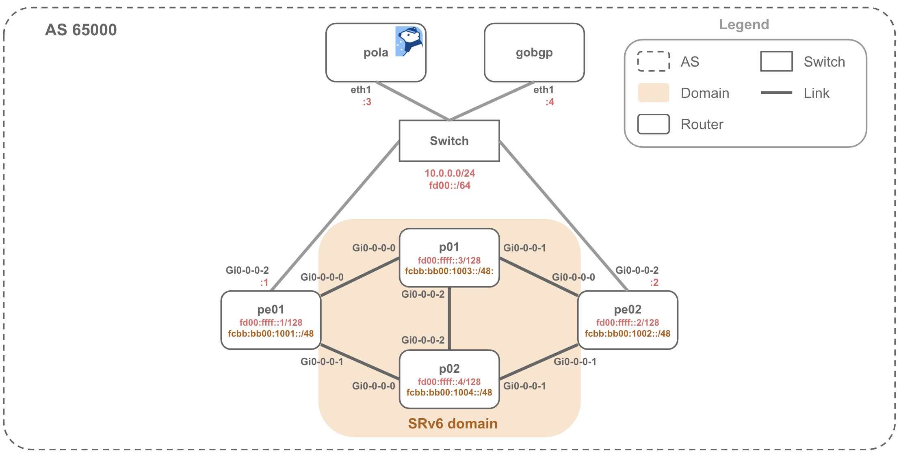

# SRv6 uSID Dynamic Path

Example topology powered by [Containerlab](https://containerlab.dev/)



## Requirements

* container host (Linux)
* vJunos image

## Usage

### Install Containerlab & vJunos-router

[Install Containerlab](https://containerlab.dev/install/)

```bash
sudo bash -c "$(curl -sL https://get.containerlab.dev)"
```

Install vJunos on [Vrnetlab](https://containerlab.dev/manual/vrnetlab/)

### Building a Lab Network

Create bridge

```bash
sudo ip link add switch type bridge
sudo ip link set dev switch up
```

Copy Pola PCE & GoBGP to bin

* GoBGP: Use [this version](https://github.com/k1yoto/gobgp/tree/feature/bgp-ls-srv6)
* Pola PCE: Replace the GoBGP module in go.mod with your local GoBGP version, e.g.:

```text
replace github.com/osrg/gobgp/v4 => ../gobgp
```

Start Containerlab network

```bash
git clone https://github.com/nttcom/pola
cd pola/examples/containerlab/srv6_usid_dynamic-path

sudo containerlab deploy
```

### Starting Daemons

```bash
$ sudo docker exec -it clab-dynamic-gobgp bash
# gobgpd -f gobgpd.yaml
```

```bash
$ sudo docker exec -it clab-dynamic-gobgp bash
# polad -f polad.yaml
```

### Show TED
```bash
$ sudo docker exec -it clab-dynamic-pola bash
# pola -p 50052 ted 
```

### Apply SR Policy

Connect to PCEP container, check PCEP session and SR policy

```bash
$ sudo docker exec -it clab-dynamic-pola bash

# pola session
sessionAddr(0): fd00::2

# pola sr-policy list
no SR Policies
```

Apply and check SR Policy

```bash
# pola sr-policy add -f pe02-policy1.yaml
success!

# pola sr-policy list
root@pola:/# ./pola -p 50052 sr-policy list
Session: fd00::2
  PolicyName: DYNAMIC-POLICY
    SrcAddr: fd00:ffff::2
    DstAddr: fd00:ffff::1
    Color: 100
    Preference: 0
    SegmentList: fcbb:bb00:1004:: -> fcbb:bb00:1001::
```

Enter container pe02 and check SR Policy

* user: admin
* pass: admin@123

```text
admin@pe02> show spring-traffic-engineering lsp brief
To                        State        LSPname
fd00:ffff::1-100<c6>      Up           DYNAMIC-POLICY


Total displayed LSPs: 1 (Up: 1, Down: 0, Initializing: 0)
```
