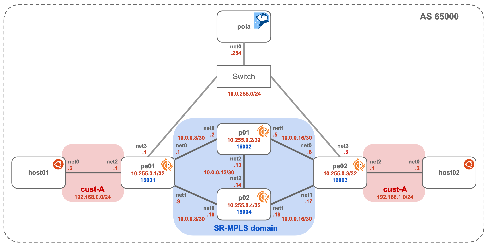

# SR-MPLS + VPNv4

Example topology with 



## Usage

Install Tinet
```
$ curl -Lo /usr/bin/tinet https://github.com/tinynetwork/tinet/releases/download/v0.0.2/tinet
$ chmod +x /usr/bin/tinet
$ tinet --version
```

Get spec.yaml, and start Docker network
```
$ git clone https://github.com/nttcom/pola
$ cd pola/examples/sr-mpls_l3vpn

$ tinet upconf | sudo sh -x
$ docker ps
```

Connect to PCEP container, check PCEP session and SR policy
```
$ docker exec -it pola /bin/bash

# /root/go/bin/pola session
peerAddr(0): 10.0.255.1
# /root/go/bin/pola lsp list
```

Create policy1.yaml (Apply Segment List 16002/16004/16003 to pe01)
```
# vi policy1.yaml
```
```
srPolicy:
    name: name
    peerAddr: 10.0.255.1
    srcAddr: 10.255.0.1
    dstAddr: 10.255.0.3
    color: 1
    segmentlist:
        - sid: 16002
          nai: 10.255.0.2
        - sid: 16004
          nai: 10.255.0.4 
        - sid: 16003
          nai: 10.255.0.3
```

Apply and check SR Policy
```
# /root/go/bin/pola lsp add -f policy1.yaml
success!
# /root/go/bin/pola lsp list
lsp(0): 
  peerAddr: 10.0.255.1
  policyName: name
  SrcAddr: 10.0.255.1
  DstAddr: 10.255.0.3
  path: 16002 -> 16004 -> 16003 

```

Move to container pe01 and check SR Policy
```
# exit
$ docker exec -it pe01 /bin/bash
root@pe01:/# vtysh

Hello, this is FRRouting (version 8.2.2).
Copyright 1996-2005 Kunihiro Ishiguro, et al.

pe01# show sr-te   
  pcep    PCEP info
  policy  SR-TE Policy
pe01# show sr-te pcep session 

PCE pola
 PCE IP 10.0.255.254 port 4189
 PCC IP 10.0.255.1 port 4189
 PCC MSD 4
 Session Status UP
<snip.>
                Total:    17     15
PCEP Sessions => Configured 1 ; Connected 1

pe01# show sr-te policy detail

Endpoint: 10.255.0.3  Color: 1  Name: name  BSID: -  Status: Active
  * Preference: 255  Name: name  Type: dynamic  Segment-List: (created by PCE)  Protocol-Origin: PCEP
```

Add Color setting
```
$ docker exec -it pe01 /bin/bash
$ vtysh -c conf t -c router bgp 65000 -c address-family ipv4 vpn -c neighbor 10.255.0.3 route-map color1 in
```

Check SR header with tcpdump
```
root@host01:/# ping 192.168.1.2
PING 192.168.1.2 (192.168.1.2) 56(84) bytes of data.
64 bytes from 192.168.1.2: icmp_seq=1 ttl=62 time=0.152 ms
64 bytes from 192.168.1.2: icmp_seq=2 ttl=62 time=0.134 ms
64 bytes from 192.168.1.2: icmp_seq=3 ttl=62 time=0.132 ms
64 bytes from 192.168.1.2: icmp_seq=4 ttl=62 time=0.161 ms
64 bytes from 192.168.1.2: icmp_seq=5 ttl=62 time=0.160 ms
^C
--- 192.168.1.2 ping statistics ---
5 packets transmitted, 5 received, 0% packet loss, time 4090ms
rtt min/avg/max/mdev = 0.132/0.147/0.161/0.012 ms
```

```
root@p01:/# tcpdump -i net0
tcpdump: verbose output suppressed, use -v or -vv for full protocol decode
listening on net0, link-type EN10MB (Ethernet), capture size 262144 bytes
17:54:11.322981 ARP, Request who-has 10.0.0.2 tell 10.0.0.1, length 28
17:54:11.323080 ARP, Reply 10.0.0.2 is-at ce:49:83:f6:54:8d (oui Unknown), length 28
17:54:11.744846 MPLS (label 16004, exp 0, ttl 63) (label 16003, exp 0, ttl 63) (label 80, exp 0, [S], ttl 63) IP 192.168.0.2 > 192.168.1.2: ICMP echo request, id 43, seq 1, length 64
17:54:11.892599 IP 10.0.0.2 > 224.0.0.5: OSPFv2, Hello, length 48
17:54:12.763059 MPLS (label 16004, exp 0, ttl 63) (label 16003, exp 0, ttl 63) (label 80, exp 0, [S], ttl 63) IP 192.168.0.2 > 192.168.1.2: ICMP echo request, id 43, seq 2, length 64
17:54:13.787076 MPLS (label 16004, exp 0, ttl 63) (label 16003, exp 0, ttl 63) (label 80, exp 0, [S], ttl 63) IP 192.168.0.2 > 192.168.1.2: ICMP echo request, id 43, seq 3, length 64
17:54:14.811191 MPLS (label 16004, exp 0, ttl 63) (label 16003, exp 0, ttl 63) (label 80, exp 0, [S], ttl 63) IP 192.168.0.2 > 192.168.1.2: ICMP echo request, id 43, seq 4, length 64
17:54:15.835103 MPLS (label 16004, exp 0, ttl 63) (label 16003, exp 0, ttl 63) (label 80, exp 0, [S], ttl 63) IP 192.168.0.2 > 192.168.1.2: ICMP echo request, id 43, seq 5, length 64
^C
8 packets captured
8 packets received by filter
0 packets dropped by kernel
root@p01:/#
```
