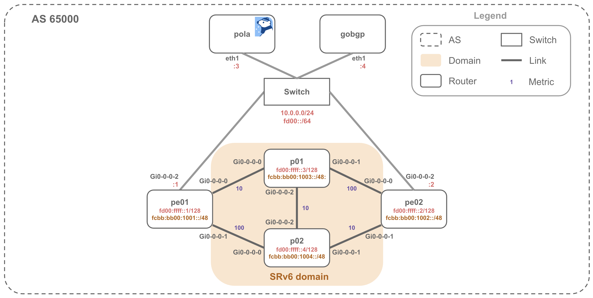

# Dynamic Path Scenario Tests

End-to-end scenario tests for dynamic path computation using Pola PCE,
GoBGP, and Containerlab.

| Lab | Test class | Covers |
| --- | --- | --- |
| [`srv6-usid/`](./srv6-usid) | `TestDynamicPath` | SRv6 uSID dynamic path and loose source routing |
| [`dual-stack/`](./dual-stack) | `TestDynamicPathDualStack` | Dual-stack TED and per-family SR-MPLS underlay selection |

Both labs verify PCEP session establishment, TED population, dynamic SR
Policy installation, and the resulting segment list on the headend router.

## SRv6 uSID Topology



- `pe01` / `pe02`: Provider edge routers
- `pe02`: PCEP PCC and SR Policy headend
- `p01` / `p02`: Core routers
- `pola`: Pola PCE
- `gobgp`: BGP-LS speaker

## Test Flow

Each lab is deployed once for the module. Each test then installs and verifies
its own SR Policy.

1. Deploy the Containerlab topology
2. Wait for PCEP session establishment and TED population
3. For each test:
   - Install an SR Policy via `pola sr-policy add`
   - Verify that it becomes `Up`
   - Verify the generated segment list

## SRv6 uSID Test Cases

### `test__srv6_usid_dynamic_path`

Installs `DYNAMIC-POLICY` with color 100.

Expected segment list:

```text
fcbb:bb00:1004::
fcbb:bb00:1003::
fcbb:bb00:1001::
```

Policy file:

```text
srv6-usid/input/sr-policies/pe02-policy1.yaml
```

> [!NOTE]
> According to the IGP cost, the traffic is forwarded along the following path:
>
> ```text
> pe02 -> p02 -> p01 -> pe01
> ```
>
> In the current Pola PCE implementation, the resulting SRv6 SID list includes the SID of every traversed node.

### `test__srv6_usid_loose_source_routing`

Installs `LOOSE-SOURCE-ROUTING-POLICY` with color 200.

Expected segment list:

```text
fcbb:bb00:1004::
fcbb:bb00:1003::
fcbb:bb00:1004::
fcbb:bb00:1003::
fcbb:bb00:1001::
```

> [!NOTE]
> According to the IGP cost, the traffic is forwarded along the following path:
>
> ```text
> pe02 -> p02 -> p01 -> p02 -> p01 -> pe01
> ```
>
> In the current Pola PCE implementation, the resulting SRv6 SID list includes the SID of every traversed node.

Policy file:

```text
srv6-usid/input/sr-policies/pe02-policy-loose-source-routing.yaml
```

## Dual-Stack Topology

```text
                  +------+
         +--------| p01  |--------+     IPv4 metric: cheap
         |        | XRd  |        |     IPv6 metric: expensive
         |        +------+        |
     +------+                +------+
     | pe01 |                | pe02 |
     | XRd  |                | Junos|
     +------+                +------+
         |        +------+        |
         +--------| p02  |--------+     IPv4 metric: expensive
                  | XRd  |              IPv6 metric: cheap
                  +------+
```

Each PE-P link is dual-stack, with independent IS-IS metrics for IPv4 and IPv6,
so the preferred path differs by address family.

## Dual-Stack Test Cases

### `test__dual_stack_links_expose_both_address_families`

Dual-stack links expose both IPv4 and IPv6 addresses in the TED.

### `test__pe02_ipv6_loopback_is_advertised_as_a_128_prefix`

`pe02` advertises its IPv6 loopback as a `/128` prefix.

### `test__pe02_ipv4_underlay_computes_the_ipv4_cheap_path`

The IPv4 underlay selects the path via `p01`.

### `test__pe02_ipv6_underlay_computes_the_ipv6_cheap_path`

The IPv6 underlay selects the path via `p02`.

> [!NOTE]
> Currently `xfail`: Junos 25.2R1.9 `pccd` rejects the PCE-initiated SR-MPLS
> policy because its SRPAG association object is IPv6-typed
> (`PCError: IPv6 SRPAG received for non SRv6 LSP`). The PCInitiate message is
> otherwise valid on the wire. See the `xfail` reason in `test_dynamic_path.py`.

### `test__pe01_ipv4_underlay_computes_the_ipv4_cheap_path`

The IPv4 underlay selects the path via `p01`.

### `test__pe01_ipv6_underlay_computes_the_ipv6_cheap_path`

The IPv6 underlay selects the path via `p02`.

> [!NOTE]
> Currently `xfail`: IOS-XR 24.4.1 rejects PCE-initiated SR-MPLS policies with
> an IPv6 endpoint. The PCEP message is correct on the wire. See the `xfail`
> reason in `test_dynamic_path.py`.
